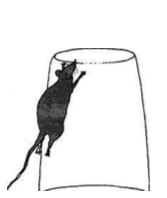
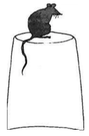
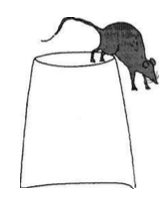
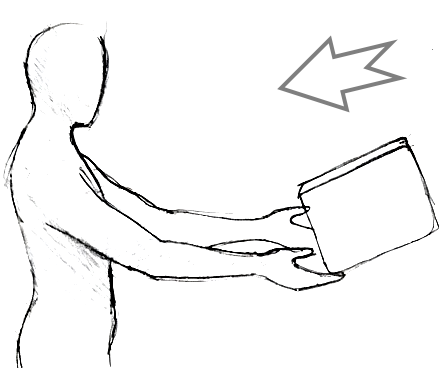
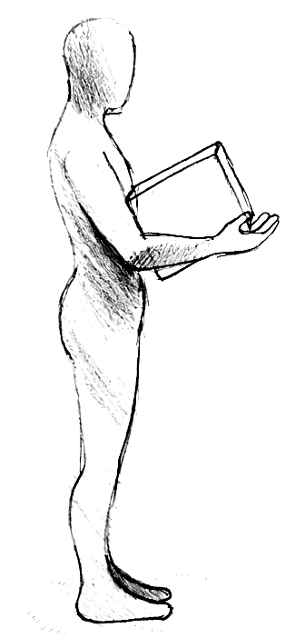
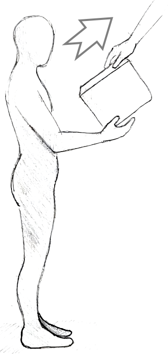
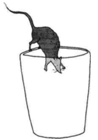
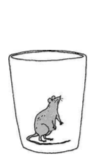
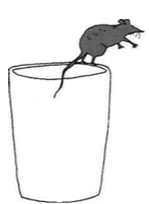

### **Куда мы идём?**

   Продолжим тему эстонских падежей. В этот раз сконцентрируемся на падежах, которые объединияются в группу "местные падежи". Это очень важная группа, потому что вопросы "**куда?**", "**где?**" и "**откуда?**", на которые они отвечают, проходят красной нитью практически через всю грамматику эстонского языка.

   Для начала выстроим эти три вопроса в три столбца и поделим эти падежи на внешне-местные и внутренне-местные. Иллюстрация ниже наглядно показывает, почему они так делятся и так называются:

   ||
Kuhu? (Куда?)

Kellele? (Кому?)
|
Kus? (Где?)

Kellel? (У кого?)
|
Kust? (Откуда?)

Kellelt? (От кого?)
|
   | :- | :-: | :-: | :-: |
   |Внешне-местные|  |||
   |||||
   |`  `окончания|**-le**|**-l**|**-lt**|
   |`  `значения|
**на** (что-то)

(кому-то дать)
|
**на** (чём-то)

**у** (кого-то есть)
|
**с** (чего-то)

**от** (кого-то взять)
|
   |Внутренне-местные||||
   |`  `окончания|**-sse** (есть исключения!)|**-s**|**-st**|
   |`  `значения|**в** (что-то)|**в** (чём-то)|**из** (чего-то)|

   Как видно на картинках, средний столбец изображает некое состояние:

- расположение предмета на чём-то, на какой-то поверхности;
- наличие предмета у кого-то;
- нахождение предмета внутри чего-то.

Первые два грамматически относятся к внешне-местным, а третье -- к внутренне-местным падежам. Левый столбец при этом обозначает движение к этому состоянию ("кому?", "на куда?", "в куда?"), а правый столбец -- наоборот, движение от этого состояния ("у/от кого?", "с чего?", "из чего?").

Теперь, покончив со структурой, рассмотрим несколько примеров. Напомню, что падежные формы получаются путём добавления к форме omastav соответствующего окончания.  Начнём с простого: у уже известного нам слова "töö" эта форма совпадает с основной.

- Ma lähen töö**le**. -- Я иду на работу.
- Ma olen töö**l**. -- Я (есть) на работе.
- Ma tulen töö**lt**. -- Я возвращаюсь с работы.

Теперь возьмём новое слово "auto" (машина, автомобиль). У него тоже omastav не отличается от nimetav, поэтому всё по-прежнему просто:

- Istun auto**sse**. -- Сажусь в машину.
- Istun auto**s**. -- Сижу в машине.
- Lähen auto**st** välja. -- Выхожу из машины.

Тут стоит обратить внимание на то, что в первых двух вариантах одинаковый стоит один и тот же глагол "istun", но смысл его меняется в зависимости от падежа, в котором стоит связанное слово. В отличие от русского, где глагол меняет форму, чтобы показать, завершено действие или нет, в эстонском эту работу часто выполняют падежи существительных или дополнительные слова. Мы ещё увидим много таких примеров.

Также стоит обратить внимание на словечко "välja". Оно означает "наружу" и практически всегда ставится в дополнение к окончанию **-st**, когда речь идёт о физическом движении наружу.

А вот пример чуть посложнее. У слова "kontor" (офис) форма omastav другая: "kontori".

- Läheme kontori**sse**! -- Пошли в офис!
- Me töötame kontori**s**. -- Мы работаем в офисе.
- Nad lähevad kontorist**st** välja. -- Они выходят из офиса.

Теперь можно вспомнить и про местоимения, которые мы затрагивали в прошлых материалах. С местоимениями всё не так складно, как с обычными существительными: основа, к которой добавляется окончание, не всегда совпадает с формой omastav, а также **-le** иногда превращается в **-lle**. Но, к счастью, всевозможных форм местоимений не так много, их можно просто выписать в табличку и запомнить. В материале №2 уже приводился обрезанный вариант этой таблички, а теперь у нас есть вся необходимая теория, чтобы проработать полный набор:

|Kes?|Кто?|Kelle**le**?|Кому?|Kelle**l**?|У кого?|Kelle**lt**?|От кого?|
| :- | :- | :- | :- | :- | :- | :- | :- |
|ma / mina|я|mu**lle** / minu**le**|мне|mu**l** / minu**l**|у меня|mu**lt** / minu**lt**|от меня|
|sa / sina|ты|su**lle** / sinu**le**|тебе|su**l** / sinu**l**|у тебя|su**lt** / sinu**lt**|от тебя|
|ta / tema|он (она, оно)|ta**lle** / tema**le**|ему (ей)|ta**l** / tema**l**|у него (у неё)|ta**lt** / tema**lt**|от него (от неё)|
|me / meie|мы|mei**le**|нам|mei**l**|у нас|mei**lt**|от нас|
|te / teie|вы|tei**le**|вам|tei**l**|у вас|tei**lt**|от вас|
|nad / nemad|они|nei**le** / nende**le**|им|nei**l** / nende**l**|у них|nei**lt** / nende**lt**|от них|

Несколько простых примеров:

- Aitäh su**lle**! -- Спасибо тебе!
- Ta**l** on küsimus. -- У неё есть вопрос.
- Mida sa mu**lt** tahad? -- Чего ты от меня хочешь?

И ещё пара слов о согласовании падежей, о котором упоминалось в предыдущем материале. Напомню, что, как и в русском языке, в эстонском языке прилагательные ставятся в тот же падеж, что и существительное: "новая машина" -- "новую машину":

- Mul on uus auto. -- У меня есть новая машина.
- Ma tahan uut autot. -- Я хочу новую машину.

Однако в этом правиле есть важное исключение. Если прилагательное (или слово, выступающее в его роли) отвечает на вопрос "чей?", то в этом случае согласования не происходит! Сравните два словосочетания: "see kiri" (это письмо), "vana kiri" (старое письмо) и "sinu kiri" (твоё письмо). Как сказать, что в письме содержится ошибка?

- Selles kirjas on viga! (*В каком письме? -- в этом. Согласование есть.*)
- Vanas kirjas on viga! (*В каком письме? -- в старом. Согласование есть.*)
- **Sinu** kirjas on viga! (*В **чьём** письме? -- в твоём. Согласования нет.*)

Ещё пара примеров для закрепления:

- Ma istun oma toas ja töötan uuel arvutil. -- Я сижу в *(чьей?)* своей комнате и работаю на *(каком?)* новом компьютере.
- Ma joon oma kohvi ja kirjutan sulle uut kirja. -- Я пью (чей?) свой кофе и пишу тебе (какое) новое письмо.
- Kas sa lähed jalutama oma vabal päeval? -- Ты пойдёшь гулять в (чей?) свой выходной? *(дословно "свободный день")*

Теперь соберём все вместе в примерах посложнее. В диалогах ниже активно используются слова из предыдущих материалов, также есль ряд новых слов и оборотов, но основной акцент делается на местные падежи.

*-- Tere hommikust! Kuhu sa lähed?*  
*-- Tere-tere! Ma lähen tööle. Mul on täna tööpäev. Aga sina?*  
*-- Mul on täna vaba päev. Istun kogu päev kodus.*  
*-- Hea sulle! Aga mina tulen töölt tagasi koju alles õhtul.*  
*-- Jõudu tööle!*

Этот диалог в общих чертах должен быть понятен на базе предыдущих материалов, а также при помощи таблички с новыми словами ниже. Однако следует отметить несколько важных моментов:

- Как уже упоминалось в предыдущем материала, "tere hommikust!" можно примерно перевести как "приветствие из утра!". Надо просто запомнить этот шаблон приветствия, где слово после "tere" должно отвечать на вопрос "из чего?".
- Слово "koju" является точным эквивалентом русского "домой". Это особая форма слова, не относящаяся ни к одному из формально существующих падежей. Аналогично тому, как мы используем нестандартное "домой" вместо "в дом", так и эстонцы говорят "koju" вместо формального "kodusse" (которое тоже существует в языке, но, как и русское "в дом", почти не используется в быту). Но при этом отдельного эквивалента для слова "дома" в эстонском нет -- эстонцы говорят просто "kodus".
- Ввиду отсутствия в эстонском грамматического будущего времени, "istun" можно перевести как в настоящем времени "сижу", так и в будущем времени "буду сидеть". Но поскольку диалог явно происходит утром, второй вариант более логичен.
- "Hea sulle" интуитивно переводится как "хорошо тебе", но по смыслу ближе к "рад за тебя" -- то есть тут нет подтекста с завистью или иронией.
- "Õhtul" переводится как "вечером". Аналогично устроены "hommikul" и "päeval". А вот "ночью" чуть посложнее: "öösel" (а не "ööl", как можно было бы предположить).

И ещё пара коротеньких диалогов:

*-- Kuhu me sööma läheme?*  
*-- Mina söön kontoris. Mul on siin oma söök kodust.*  
*-- Hästi, mina lähen kohvikusse. Tahan süüa, aga minul siin sööki ei ole!*  
*-- Head isu!*  
*-- Sulle ka head isu!*

*-- Kus sa oled? Sind ei ole kontoris.*  
*-- Ma alles söön. Varsti tulen.*  
*-- Hästi, ootan sind sinu toas!*

Табличка с новыми словами. Глаголы, как и раньше, приводятся в трёх формах (ma-, da- и я-формы), а существительные -- в трёх падежах (nimetav, omastav, osastav).

|tulema -- tulla -- tulen|приходить, прибывать|
| :- | :- |
|istuma -- istuda -- istun|сидеть, садиться|
|ootama -- oodata -- ootan|ждать|
|kodu -- kodu -- kodu|дом|
|koju|домой|
|auto -- auto -- autot|машина, автомобиль|
|kontor -- kontori -- kontorit|офис|
|kohvik -- kohviku -- kohvikut|кафе|
|jõud -- jõu -- jõudu|сила|
|jõudu tööle!|пожелание успеха в работе (дословно "силы на работу!")|
|kogu|весь, целый|
|hästi|хорошо|
|varsti|скоро|
|tagasi|назад, обратно|
|alles|только, лишь, ещё|

Вопросы для самопроверки.

1. Скажите по-эстонски: "*Я сегодня работаю из дома*".
1. Спросите по-эстонски: "*Мы пойдём сегодня вечером в кафе?*"
1. Переведите на эстонский фразу: "*У нас в офисе есть вода, чай и кофе*". Помните, что речь идёт о неисчислимых сущностях! Также попробуйте заменить формулировку "*у нас в офисе*" на "*в нашем офисе*".
1. Скажите по-эстонски: "*Я выхожу из дома и иду на работу. Вечером вернусь*".
1. Переведите на эстонский: "*У меня нет сил работать. Я пошёл домой спать*".
1. Пожалуйтесь по-эстонски: "*Я жду его целый день, но он не приходит*".
1. Спросите по-эстонски: "*Мой эстонский язык хороший?*"
1. Переведите на эстонский язык диалог:\
   *-- Где ты? Я жду тебя в кафе.\
   -- Я ещё работаю. Скоро подойду.\
   -- Хорошо, жду!*
1. Спросите по-эстонски: "*Я хочу есть. В вашем кафе есть еда? У вас есть свободный стол (laud)?*"
1. \*В 2004 году в Эстонии вышел фильм под названием, которое можно перевести на русский как "Сегодня ночью мы не будем спать". Попробуйте угадать оригинальное название фильма.
